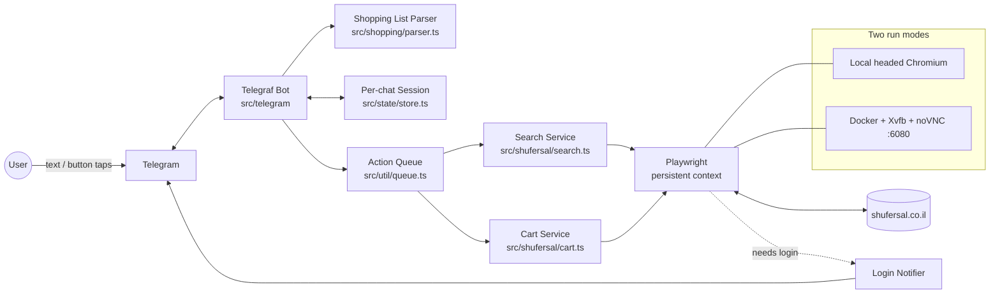
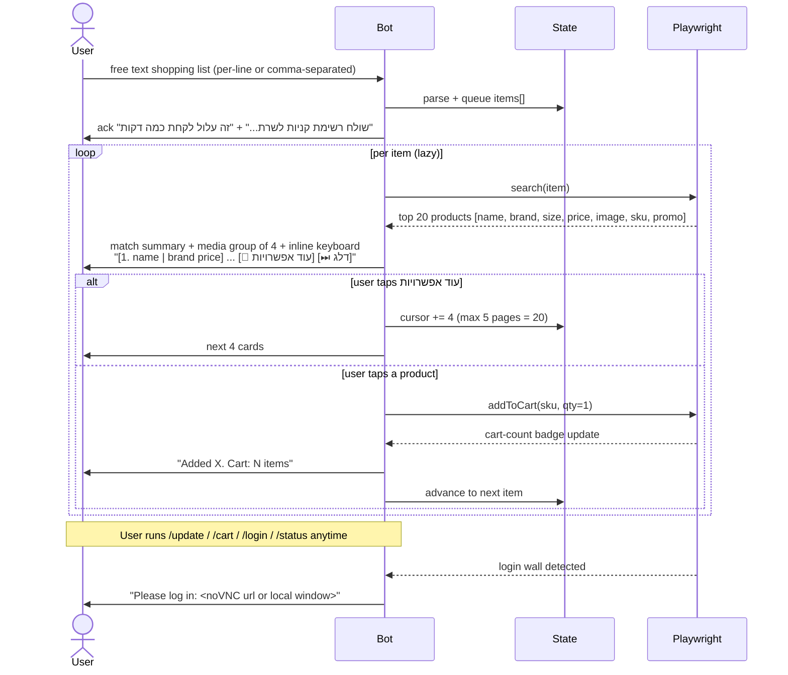

# Shufersal Shopping Agent — Phase 1: Project, Stack, Architecture

> Status: **Draft for review** · Owner: Tal · Last updated: 2026-05-16
> A Telegram-driven shopping agent that drives [shufersal.co.il](https://www.shufersal.co.il/) via Playwright. The user sends a shopping list; the bot searches each item, returns paginated product cards (4 per page, max 5 pages = 20 results), and adds chosen products to the Shufersal cart. Manual login and final checkout stay with the user. The bot's UX must match the previous `myShopper` bot (commands, syntax, message shapes) — see §11.

---

## 1. Tech Stack (and why)

- **Runtime**: Node.js 20 LTS + TypeScript 5 (strict) — one language end-to-end with Playwright.
- **Browser automation**: [`playwright`](https://playwright.dev) (Chromium) using `chromium.launchPersistentContext` so the **Shufersal login session survives restarts** (cookies + localStorage on disk in `./auth/`).
- **Telegram**: [`telegraf`](https://telegraf.js.org) v4 — typed, modern, great inline-keyboard + media-group support (needed for the 4-products-per-page UX).
- **Validation / config**: `zod` for env + parsed messages; `dotenv` for `.env`.
- **Logging**: `pino` + `pino-pretty` (structured logs, easy to ship later).
- **State (MVP)**: in-memory `Map` keyed by `chatId`, behind a `StateStore` interface so we can swap in Redis/JSON-file later without touching call sites.
- **Action serialization**: a tiny in-process FIFO queue around the browser — a single Chromium instance can only do one thing at a time, so all Telegram callbacks must serialize through it.
- **Container / remote access**: `Dockerfile` based on `mcr.microsoft.com/playwright:v1.48.0-jammy` + `xvfb`, `x11vnc`, `websockify`, `novnc`. `docker-compose.yml` exposes port `6080` for noVNC (bound to `127.0.0.1` by default, with optional `NOVNC_PASSWORD` for remote access). Open `http://<host>:6080` from any device when login is needed.
- **Dev tooling**: `tsx` (watch mode), `vitest` (parser + session unit tests), `eslint` + `prettier`.

**Telegraf vs `node-telegram-bot-api`**: Telegraf's session middleware and callback-query helpers map 1:1 to the "pick product / next 4 / quantity" wizard.

**Persistent context vs storage-state JSON**: Shufersal is a heavy SPA with anti-bot signals — reusing the profile dir behaves more like a real returning user than re-injecting cookies.

---

## 2. High-Level Architecture



---

## 3. Core Flow



---

## 4. Project Structure

```
shopper/
├── package.json
├── tsconfig.json
├── .env.example                 # TELEGRAM_BOT_TOKEN, ALLOWED_USER_IDS, RUN_MODE=local|docker, HEADLESS, NOVNC_URL, NOVNC_PASSWORD, LOG_LEVEL, USER_DATA_DIR
├── .gitignore                   # node_modules, auth/, dist/, traces/, state/
├── README.md                    # setup for both run modes + security notes
├── Dockerfile
├── docker-compose.yml           # app + noVNC on 127.0.0.1:6080
├── src/
│   ├── index.ts                 # boots browser then bot, graceful shutdown
│   ├── config.ts                # zod-validated env
│   ├── telegram/
│   │   ├── bot.ts               # Telegraf instance, auth middleware (whitelist)
│   │   ├── handlers.ts          # /start, /help, /cart, /update, /login, /status, /reset, on('text'), on('callback_query')
│   │   ├── keyboards.ts         # productKeyboard(page, totalPages), navigation row
│   │   ├── formatters.ts        # caption: "N. name (size | brand) - ₪price" + promo
│   │   └── help.ts              # Hebrew help text (mirrors old bot's /help, §11.1)
│   ├── shufersal/
│   │   ├── browser.ts           # launchPersistentContext, headed/headless toggle
│   │   ├── session.ts           # isLoggedIn(), waitForLogin(), notify-on-walls
│   │   ├── search.ts            # search(query, opts:{brand?,weight?}) -> Product[]
│   │   ├── cart.ts              # addToCart(sku, qty), removeFromCart(sku|idx), setQty(sku|idx, n), getCart(), getCartBadgeCount()
│   │   └── selectors.ts         # single source of truth for DOM selectors
│   ├── shopping/
│   │   ├── parser.ts            # multi-line + comma-separated, qty/units/brand syntax (§5.1)
│   │   ├── session.ts           # ChatSession: items[], currentIdx, cursor, lastResults
│   │   └── types.ts             # Product, ShoppingItem, CartLine, SellingMethod
│   ├── state/
│   │   └── store.ts             # interface StateStore + InMemoryStore (+ JsonFileStore for crash-safety)
│   └── util/
│       ├── logger.ts            # pino, with chatId+requestId correlation
│       └── queue.ts             # serialize all Playwright work
├── auth/                        # persistent Chromium profile (gitignored, chmod 700)
├── state/                       # JSON state snapshots (gitignored)
├── traces/                      # screenshots + playwright traces on failure (gitignored)
└── tests/
    ├── parser.test.ts
    └── session.test.ts
```

---

## 5. Telegram UX (must match the existing `myShopper` bot — see §11)

### 5.1 Input syntax (free text in any message)

- **One per line** or **comma-separated**: `2 חלב, 3 לחם, ביצים`
- **Quantity prefix**: `2 חלב` or `חלב x2`
- **Units / weight**: `1 ק"ג עגבניות`, `אורז בסמטי 5 ק"ג`, `500 גרם גבינה` (sets `sellingMethod=weight`)
- **Brand**: `קפה שחור 3 @עלית` **or** `שמן זית 2 מותג:שופרסל`
- **Brand + weight**: `אבקת כביסה @אריאל 7 ק"ג`
- **Remove**: `הסר חלב` or `הסר #3` (by cart index)
- Lines starting with `#` and blank lines are ignored.

### 5.2 Search results (per item)

1. Bot acks once with `שולח רשימת קניות לשרת...` then `⏳ זה עלול לקחת כמה דקות`.
2. Match summary message:
   - `✅ נמצאו התאמות (N)` for exact matches, or
   - `🔍 לא נמצאה התאמה מדויקת (N): • <item>` when fuzzy.
3. **`sendMediaGroup`** of 4 product photos. Captions follow the existing format:
   `N. <name> (<size> | <brand>) - ₪<price>` plus a promo line (`מבצע` or `8 יח' ב- 30 ₪`) when present.
4. Follow-up message with an **inline keyboard, one button per product**:
   - `1. <short name> | <brand> <price>₪`
   - `2. ...` `3. ...` `4. ...`
   - Navigation row: `🔽 עוד אפשרויות` (omitted on the last page or when fewer than 20 results) · `⏭ דלג`
5. Tap a product → it is **added to cart with qty 1 by default** (the old bot's default); quantity is adjusted later via `/update`. No separate quantity prompt in the happy path — keeps the flow as fast as the old bot.
6. **Weighted items**: when `sellingMethod=weight`, the picker buttons append the parsed weight (`1.5 ק"ג`) and `addToCart` uses it; default 1 unit otherwise.

### 5.3 Pagination

4 results per page, max 5 pages = 20 results. `🔽 עוד אפשרויות` is hidden when no further results exist.

### 5.4 Callback payload schema

`pick:<itemId>:<resultIdx>` / `more:<itemId>` / `skip:<itemId>` (where `itemId` is a short ULID kept in state so long Hebrew names never blow Telegram's 64-byte `callback_data` limit).

### 5.5 Commands

| Command | Behavior | Phase |
|---|---|---|
| `/start` | Welcome + short usage | 1 |
| `/help` | Full Hebrew help (verbatim from old bot, §11.1) | 1 |
| `/cart` | Numbered cart list + total + item count | 1 |
| `/cart תמונות` | Same as `/cart` with a media group of product images | 1 |
| `/update <qty> <name>` | Set qty for product by name (`0` = remove) | 1 |
| `/update #<idx> <qty>` | Set qty for cart item by index (`0` = remove) | 1 |
| `/login` | Show noVNC URL / focus local Chromium for manual login | 1 |
| `/status` | Login state + browser health + queue depth | 1 |
| `/reset` | Clear chat session (not browser session) | 1 |
| `/history` | List past Shufersal orders; tap one to re-shop it (adds all/selected items back to cart) | 1 |
| `/profile` | Category preferences (kosher level, organic, etc.) | 2 |
| `/preferences` | Favorite products + selection strategy (cheapest / brand-loyal / best deal) | 2 |

### 5.5.1 `/history` details

- Scrape the account orders page (Shufersal: `/account/orders` area) via Playwright, list the last ~10 orders.
- Each order rendered as one Telegram message: date, total, item count, with an inline keyboard:
  - `🛒 שחזר הכל` (re-shop entire order — adds every item to cart with the same qty, skipping out-of-stock)
  - `📋 פרט פריטים` (list items with per-item checkboxes; tap to toggle, then `הוסף סומנים`)
  - `❌ סגור`
- Re-shop runs through the same `addToCart()` path so cart-update + error handling are shared with the search flow.
- Out-of-stock items are reported back as `⚠️ X פריטים לא זמינים: ...`

### 5.6 Status / thinking messages (verbatim from old bot)

- Search: `שולח רשימת קניות לשרת...` then `⏳ זה עלול לקחת כמה דקות`.
- Cart fetch: `🛒 שולח בקשת עגלה לשרת...`
- Remove: `🗑 מסיר "<name>" מהעגלה...` then `✅ "<name>" הוסר מהעגלה.`
- Add: `➕ הוספתי "<name>" לעגלה (₪<price>).`

---

## 6. Anti-Bot & Reliability

- Single persistent Chromium profile, realistic UA (Playwright default), no parallel tabs.
- All browser actions go through a FIFO `queue.ts` — one shopper, one browser, one action at a time.
- Each action wrapped in retry (max 2) + screenshot-on-failure into `traces/<timestamp>-<chatId>.png`.
- Login wall detection: every action first checks `isLoggedIn()`; if false, pings Telegram with the noVNC URL (Docker mode) or "use the open Chromium window" (local mode), then polls until the wall disappears or the user runs `/status`.
- Wait-for-cart-update after every add (`page.waitForResponse` on the cart endpoint, or DOM badge increment) so we never read stale counts.
- `getCart()` is only used for `/cart`; per-add updates use the cheap cart-count badge already in the DOM.

---

## 7. Out-of-Scope for Phase 1 (explicit)

- Multi-user concurrency (whitelist a single Telegram user via `ALLOWED_USER_IDS`).
- LLM-based fuzzy matching of shopping items (basic Levenshtein/contains is enough for MVP).
- Automated checkout / payment (user's domain).
- Persistent state across process restarts (in-memory + JSON snapshots; no Redis yet).
- `/profile`, `/preferences` (Phase 2 — old bot has them, see §11.2). `/history` is **in** Phase 1.

---

## 8. What Phase 1 Delivers on Confirmation

Just the **scaffolding**: `package.json`, `tsconfig.json`, `.env.example`, `Dockerfile`, `docker-compose.yml`, `README.md`, all files under `src/` as **typed stubs with TODOs and clear interfaces** (so the structure compiles and runs `/start` + `/help` end-to-end), plus one happy-path placeholder for `search()` returning a hardcoded product list so you can validate the Telegram UX matches the old bot before we wire real DOM selectors in Phase 2.

- **Phase 1** (this scaffolding task): all 9 MVP commands wired with stubs, `/help` shows the verbatim Hebrew text from §11.1, end-to-end happy path works against hardcoded fake data.
- **Phase 2** (separate task): real Shufersal selectors for `search`, `addToCart`, `removeFromCart`, `setQty`, `getCart`, `getCartBadgeCount`, login detection, **and order history scraping** for `/history`.
- **Phase 3** (separate task): `/profile` and `/preferences` (category prefs, favorite products, selection strategies).

---

## 9. Review & Proposed Improvements

Each item labelled **MUST / SHOULD / NICE** so we can triage.

### 9.1 Correctness gaps

- **MUST — Weighted items (sold by kg)**. Quantity isn't always integer 1..5. `Product` exposes `sellingMethod: "unit" | "weight"`, and weight is taken from the user's input (`1 ק"ג עגבניות`) or defaulted (e.g., 1 kg) and confirmed via inline buttons only when ambiguous.
- **MUST — Inline keyboard sized for Hebrew**. Telegram inline button text has a 64-byte limit (Hebrew = 2 bytes/char). Per-product buttons (`1. name | brand price₪`) are truncated server-side to fit; the full info is in the photo caption.
- **MUST — Fewer than 20 results**. If Shufersal returns 7, hide `🔽 עוד אפשרויות` after page 2. `totalPages = min(5, ceil(results.length/4))`.
- ~~**SHOULD — Lazy search**~~. **Decided: eager.** Search all items upfront, store results in session state, then walk the user through picks. State store (§9.7) makes this safe across restarts.
- **SHOULD — Cart count via DOM badge, not full fetch**. Cheap after every add; `/cart` is the only place that does a full `getCart()`.
- **SHOULD — Wait-for-cart-update**. `await page.waitForResponse(/cart/i)` or badge-incremented before reading.
- **NICE — Product image hotlinking fallback**. Pass Shufersal CDN URLs directly to `sendMediaGroup`; if Telegram rejects (403/hotlink block), fetch via `context.request.get(url)` (reuses session) and upload as buffer.

### 9.2 Security & ops

- **MUST — noVNC not openly exposed**. Bind `:6080` to `127.0.0.1` in `docker-compose.yml`. Optional `NOVNC_PASSWORD` for remote access; if set, websockify enforces auth. README must call this out loudly.
- **MUST — `auth/` permissions**. `chmod 700 auth/` on creation; document it contains login cookies and must not be committed/shared.
- **SHOULD — Friendly error pipeline**. Wrap every callback handler; on exception save screenshot + trace, log full error server-side, reply with `"משהו השתבש — נסה /reset ושוב."` (no stack traces leaking).
- **SHOULD — Graceful shutdown**. SIGINT/SIGTERM handlers stop accepting Telegram updates, drain the queue, persist state, `context.close()`. Prevents `auth/` corruption on Ctrl+C.
- **NICE — Playwright tracing on failure**. `context.tracing.start({ screenshots:true, snapshots:true })` per action, `tracing.stop({ path:traces/<id>.zip })` only on error.

### 9.3 Hebrew / RTL specifics

- **SHOULD — Parser format spec** locked in §5.1.
- **SHOULD — RTL in Telegram captions**. Prefix captions with U+200F (RLM) to force RTL rendering on mixed Hebrew/Latin lines.

### 9.4 Configuration additions

- **MUST — Extend `.env.example`** with `LOG_LEVEL`, `NOVNC_PASSWORD`, `USER_DATA_DIR` (default `./auth`), `SHUFERSAL_URL` (allow staging override), `MAX_PAGES` (default 5), `RESULTS_PER_PAGE` (default 4).
- **SHOULD — Pin Playwright base image** to a specific version (`mcr.microsoft.com/playwright:v1.48.0-jammy`) and pin `playwright` in `package.json` to the matching version.

### 9.5 UX additions on top of old bot

- **SHOULD — `/search <query>`** for ad-hoc product lookup outside the list flow (forgot-an-item).
- **SHOULD — Refine button** on results: extra navigation row entry `✏ חיפוש מחדש` (prompts user for a corrected query for the current item only).
- **NICE — Progress indicator** between items: `[3/12] ✓ נוסף. הבא: עגבניות...`.

### 9.6 Observability

- **SHOULD — Correlation IDs**. Every Telegram update gets a `requestId`; all pino logs and screenshot filenames include `chatId` + `requestId`.

### 9.7 State persistence (decided)

- `StateStore` interface with two implementations: `InMemoryStore` (read-through cache) + `JsonFileStore` (writes `state/<chatId>.json` atomically on every change, `chmod 600`).
- Versioned schema with a `v` field for future migrations.
- Corrupt-file fallback: detect → log warning → start fresh session.
- Swappable for `RedisStore` later behind the same interface (no call-site changes).

---

## 10. Decisions

All planning questions are answered. Ready to scaffold on your go-ahead.

- ✅ Scope: MVP **+ `/history`** in Phase 1. `/profile`, `/preferences` → Phase 3.
- ✅ Old codebase: fresh rewrite, screenshots in §11 are the UX spec.
- ✅ Adopt all **MUST** items in §9.
- ✅ Search strategy: **eager** (search all 20 items upfront, store, then walk picks).
- ✅ State store: **`InMemoryStore` + `JsonFileStore`** (atomic writes to `state/<chatId>.json`).

---

## 11. Reference: Existing `myShopper` Bot UX (must preserve)

Extracted verbatim from screenshots of the previous bot — kept here as the source of truth for the new bot's UX.

### 11.1 `/help` (Hebrew, full text)

```
📋 עזרה

הוספת מוצרים:
פשוט שלח שם מוצר או רשימה:
  חלב
  2 חלב, 3 לחם, ביצים

פורמטים נתמכים:
  • מוצר בכל שורה
  • מופרדים בפסיקים
  • עם כמות:      2 חלב, 3 לחם
  • עם יחידות:    1 ק"ג עגבניות
  • לפי משקל/גודל: אורז בסמטי 5 ק"ג
  • עם מותג: הוסף @מותג או מותג:שם
        קפה שחור 3 @עלית
        שמן זית 2 מותג:שופרסל
  • מותג + משקל:
        אבקת כביסה @אריאל 7 ק"ג

הסרת מוצרים:
הוסף "הסר" לפני שם המוצר או מספר פריט:
  הסר חלב
  הסר #3   (לפי מספר בעגלה)

עדכון כמות:
  /update 3 חלב
  /update 0 שוקולד               (מסיר)
  /update #3 2                    (עדכון פריט 3 בעגלה)
  /update #3 0                    (הסרת פריט 3)

פקודות:
  /cart        - הצג עגלה
  /login       - התחבר לשופרסל
  /status      - בדוק חיבור
  /history     - סרוק הזמנות קודמות
  /profile     - הצג העדפות קטגוריות
  /preferences - הצג/נהל מוצרים מועדפים + אסטרטגיות
```

### 11.2 Observed message shapes

**Search ack**
```
🛒 שולח רשימת קניות לשרת...
<query>
⏳ זה עלול לקחת כמה דקות
```

**Match summary** (fuzzy)
```
📊 סיכום:
🔍 לא נמצאה התאמה מדויקת (1):
  • <item>
```

**Per-product caption (one per album image)**
```
N. <name> (<size> גרם | <brand>) - ₪<price>
<promo line if present, e.g. "8 יח' ב- 30 ₪" or "מבצע">
```

**Inline keyboard (one button per product)**
```
[ 1. <short name> | <brand> <price>₪ ]
[ 2. ... ]
[ 3. ... ]
[ 4. ... ]
[ 🔽 עוד אפשרויות ]
```

**Cart view (`/cart`)**
```
🛒 העגלה שלך:

1. שוקולד פרה לבן  - ₪44.50  x5
2. חלב בקרטון 3% שומן - ₪36.40  x5
3. קוטג' 5% שומן  - ₪6.10  x1
4. שוקו מועשר טרה בקבוק - ₪12.40 x2

💰 סה"כ: ₪99.40
📦 4 מוצרים

לצפייה עם תמונות: /cart תמונות
```

**Update / remove acks**
```
🗑 מסיר "<name>" מהעגלה...
✅ "<name>" הוסר מהעגלה.
```
